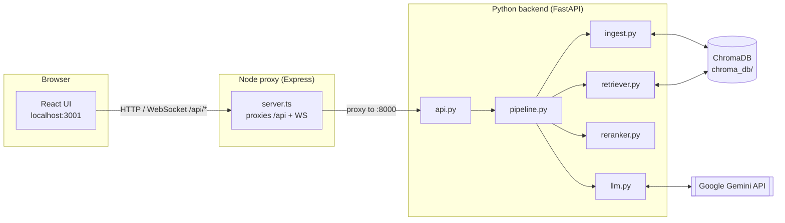
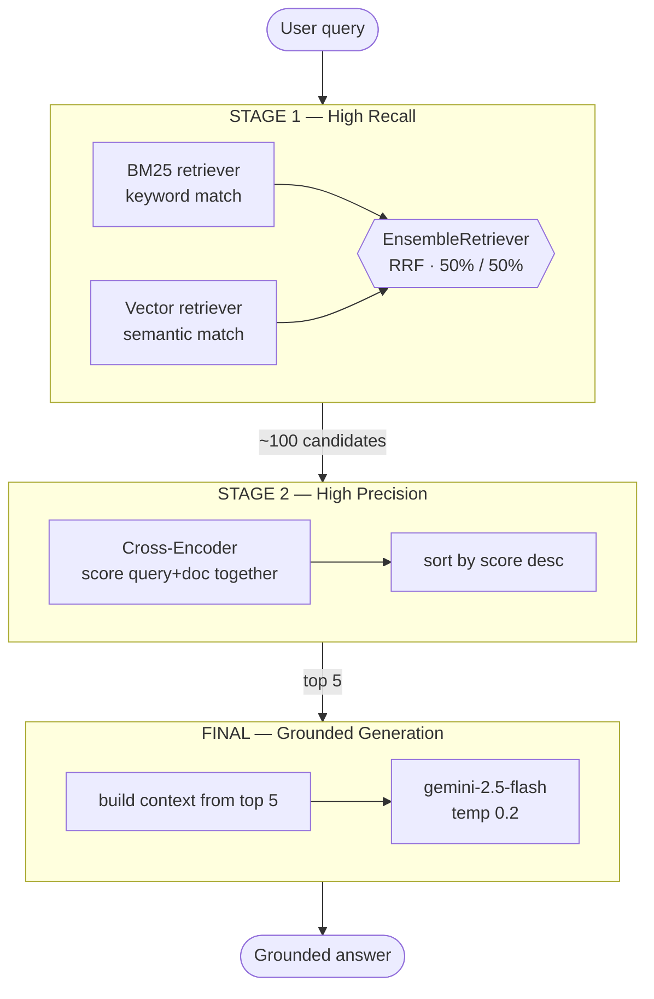
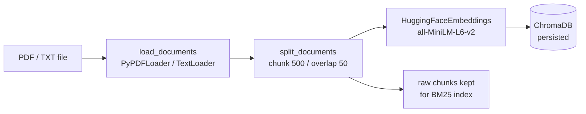
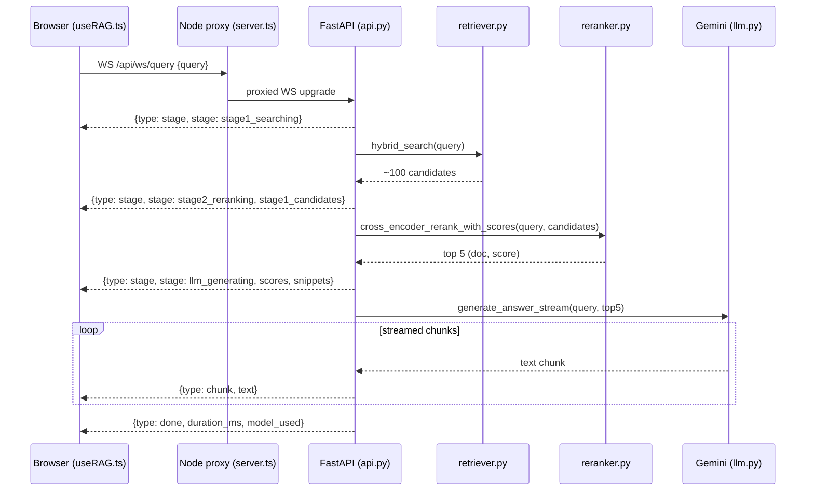
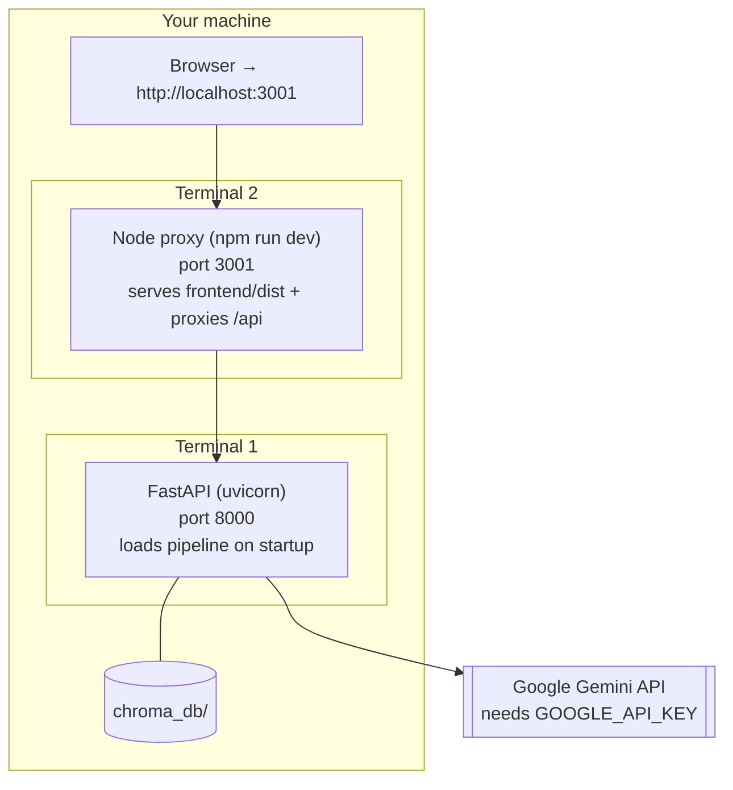
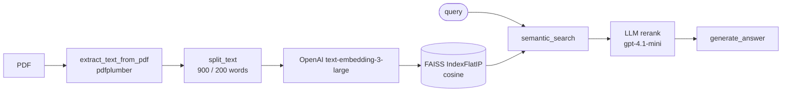

# Code Explained — IITP RAG (with Diagrams)

A concept-first walkthrough of how this codebase works, with diagrams and exact pointers into the source. For a plain file-by-file reference see [PROJECT_DETAILS.md](PROJECT_DETAILS.md); to run it see [RUN_GUIDE.md](RUN_GUIDE.md).

> Diagrams below use **Mermaid**. They render automatically on GitHub and in VS Code's Markdown preview (with a Mermaid extension). An ASCII version of the main flow is included too.

---

## 1. The big picture

This repo has **two RAG systems**. The main one is **System 2 (`two_stage_rag`)** — a full web app. RAG = *Retrieval-Augmented Generation*: instead of asking an LLM to answer from memory, we **retrieve** relevant passages from your documents and make the LLM answer **only** from those — which reduces hallucination and lets you cite sources.



---

## 2. The two-stage RAG idea

The core design is **retrieve wide, then narrow**:

| Stage | Goal | Technique | Output |
|-------|------|-----------|--------|
| **Stage 1** | High **recall** (don't miss anything) | Hybrid search: BM25 (keywords) + vector (meaning) | up to 100 candidates |
| **Stage 2** | High **precision** (keep only the best) | Cross-Encoder reranking | top 5 |
| **Final** | Grounded answer | Gemini, given only the top 5 | answer text |



Why each piece exists:
- **BM25** nails exact terms (names, IDs, "InsightAI") — see [retriever.py](two_stage_rag/retriever.py#L41).
- **Vector search** catches paraphrases/synonyms via embeddings — [retriever.py](two_stage_rag/retriever.py#L71).
- **EnsembleRetriever** fuses both rankings (Reciprocal Rank Fusion) — [retriever.py](two_stage_rag/retriever.py#L131).
- **Cross-Encoder** reads query + doc *together* for accurate relevance, but is slow — so it's applied only to the 100 candidates — [reranker.py](two_stage_rag/reranker.py#L72).
- **Gemini** writes the final answer from the 5 best chunks, instructed to say "I don't know" if the answer isn't present — [llm.py](two_stage_rag/llm.py#L64).

---

## 3. Key concepts (and where they live)

### Chunking
Splitting documents into small overlapping pieces so each becomes one searchable, embeddable unit.
- **System 2:** `RecursiveCharacterTextSplitter`, 500 chars / 50 overlap — [ingest.py:74](two_stage_rag/ingest.py#L74), config at [ingest.py:28](two_stage_rag/ingest.py#L28).
- **System 1:** word-window split, 900/200 — [pdf_loader.py:14](pdf_rag/pdf_loader.py#L14).

```
Document ──► [chunk 1] [chunk 2] [chunk 3] ...
                 └──50 char overlap──┘   (context preserved across the cut)
```

### Embeddings & the Bi-Encoder
An **embedding** turns text into a vector (list of numbers) so similar meanings sit close together. A **Bi-Encoder** encodes the query and each document *separately* — fast, so it scales to the whole corpus.
- Model `all-MiniLM-L6-v2` (384-dim), CPU — [ingest.py:30 & 119](two_stage_rag/ingest.py#L119).

### Vector store (ChromaDB)
Stores chunk embeddings and does fast nearest-neighbour search (cosine similarity).
- Built/persisted at `two_stage_rag/chroma_db/` — [ingest.py:101](two_stage_rag/ingest.py#L101).

### BM25 (keyword search)
A classic TF-IDF-style ranking that rewards exact keyword overlap and normalizes for length.
- [retriever.py:41](two_stage_rag/retriever.py#L41).

### Cross-Encoder (reranker)
Unlike the bi-encoder, it feeds *query + document together* through one transformer for a precise relevance score — accurate but slow, so it's used only on the candidates. It returns docs **and** scores in one pass; an optional `RERANK_MIN_SCORE` drops clearly-irrelevant chunks (keeping ≥1).
- Model `cross-encoder/ms-marco-MiniLM-L-6-v2`, top-5 — [reranker.py](two_stage_rag/reranker.py).

### Grounded generation
The prompt forces the LLM to answer **only** from the retrieved context and to admit when it can't. If the best reranked score is below `ANSWER_MIN_SCORE` (opt-in), the pipeline returns "I don't know" and **skips the LLM entirely**. Transient Gemini errors (`429` + `5xx`) are retried with backoff.
- Prompt template + retry — [llm.py](two_stage_rag/llm.py); generation via `generate_answer()` / `generate_answer_stream()`.

---

## 4. Ingestion pipeline (Stage 0)

What happens when you upload/`--ingest` a document:



Code: [ingest.py: `ingest_documents()`](two_stage_rag/ingest.py#L143) → `load_documents()` → `split_documents()` → `build_vector_store()`. Returns the raw chunks so [retriever.py](two_stage_rag/retriever.py#L41) can build the BM25 index from them.

> Note: ingestion **appends** by default (both docs stay indexed) — pass `replace=True` / the `/api/ingest` `replace` flag to clear the collection first. After any ingest, BM25 is rebuilt over the **full** collection so keyword search covers every document. Extraction whitespace is normalized on load.

---

## 5. Query lifecycle (web UI, streaming)

A full request from the browser through the WebSocket:



Code map:
- Client hook: [useRAG.ts](two_stage_rag/frontend/src/hooks/useRAG.ts#L104) (`sendQuery`) — opens the WebSocket, falls back to plain HTTP `/api/query` on error.
- WebSocket handler: [api.py: `websocket_query`](two_stage_rag/api.py#L295) — emits `stage` / `chunk` / `done` / `error` events.
- Non-streaming path: [api.py: `run_query`](two_stage_rag/api.py#L236).
- Orchestration (CLI path): [pipeline.py: `TwoStageRAGPipeline.run`](two_stage_rag/pipeline.py#L107).
- Blocking stages (search / rerank / Gemini) run inside `asyncio.to_thread`, so the event loop stays free and the WebSocket keepalive isn't starved on slow/cold queries.
- If the top reranked score < `ANSWER_MIN_SCORE`, the handler sends "I don't know" and skips Gemini.

---

## 6. Component & deployment view



Port map: **:3001** = the UI (open this) · **:8000** = raw API + `/docs` Swagger · **:5173** = Vite dev server (Node 20+ only).

---

## 7. Models & key settings

| Role | Value | Source |
|------|-------|--------|
| Chunk size / overlap | 500 / 50 chars | [ingest.py:28](two_stage_rag/ingest.py#L28) |
| Embeddings (bi-encoder) | `all-MiniLM-L6-v2` (384-d) | [ingest.py:30](two_stage_rag/ingest.py#L30) |
| Stage-1 candidates (k) | 100 | [retriever.py:36](two_stage_rag/retriever.py#L36) |
| Hybrid weights | BM25 0.5 / Vector 0.5 | [retriever.py:37](two_stage_rag/retriever.py#L37) |
| Reranker (cross-encoder) | `ms-marco-MiniLM-L-6-v2`, top 5 | [reranker.py:41](two_stage_rag/reranker.py#L41) |
| LLM | `gemini-2.5-flash`, temp 0.2, 1024 max tokens | [llm.py:51](two_stage_rag/llm.py#L51) |

---

## 8. System 1 — `pdf_rag` (the alternate, OpenAI/FAISS)

A simpler single-file-store pipeline used by `run_rag.py`:



Code: [qa.py](pdf_rag/qa.py#L13) orchestrates [pdf_loader.py](pdf_rag/pdf_loader.py), [embeddings.py](pdf_rag/embeddings.py), [vector_store.py](pdf_rag/vector_store.py), [retriever.py](pdf_rag/retriever.py).

> ⚠️ This system currently **won't run**: it uses the pre-1.0 OpenAI API (`openai.Embeddings.create`, `openai.ChatCompletion.create`) but installs `openai>=1.0`. It needs migrating to `client.embeddings.create` / `client.chat.completions.create`.

---

## 9. Improvements — done & remaining

**Done** (Tier 1 + Tier 2 — see [IMPROVEMENTS.md](IMPROVEMENTS.md)):
- ✅ Retry transient 5xx (not just 429) — `llm.py`
- ✅ `RERANK_MIN_SCORE` threshold + single-pass `rerank_with_scores` — `reranker.py` / `api.py`
- ✅ `ANSWER_MIN_SCORE` "I don't know" short-circuit — `llm.py` / `pipeline.py` / `api.py`
- ✅ BM25 over full collection + ingest replace-mode + whitespace normalization — `pipeline.py` / `ingest.py`
- ✅ Proxy POST-body fix + WS `asyncio.to_thread`; completed `requirements.txt`; Node 20 + Linux JS deps

**Remaining:**
1. Source citations (filenames/pages) in the UI — needs a React change + `dist` rebuild (now possible on Node 20).
2. Fix System 1 (`pdf_rag`) for the `openai>=1.0` SDK.
3. Tier 3: Dockerize, API auth + upload limits, eval harness.
